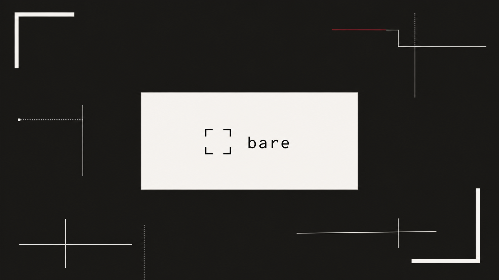

<p align="center">
  
</p>

<h1 align="center">bare</h1>

<p align="center">
  сообщения шифруются в браузере · история остаётся на устройстве · сервер доставляет шифротекст
</p>

<p align="center">
  <a href="https://bare.xmatic.team">открыть bare</a> ·
  <a href="docs/philosophy.md">философия</a> ·
  <a href="docs/threat-model.md">модель угроз</a>
</p>

## что это

Bare — маленький независимый E2EE-чат, а не платформа. Он умеет личные чаты и комнаты, работает как PWA, присылает уведомления и переносит локальную историю через зашифрованный файл `.bare`.

Клиент — HTML, CSS и vanilla JS без npm и сборки. Сервер — Go + SQLite, статика встроена в один бинарь.

- **без аккаунтной обвязки** — только ник и пароль, без email, телефона и OAuth;
- **локальная история** — сообщения после доставки живут в IndexedDB текущего устройства, а не в облачном архиве;
- **сервер-реле** — сервер хранит метаданные и временную очередь недоставленных шифротекстов, удаляя сообщения после подтверждения устройства;
- **криптография в браузере** — пароль не покидает клиент, личные чаты и комнаты шифруются через WebCrypto;
- **простая поверхность аудита** — клиент состоит из читаемых ES-модулей без бандлера и скрытого шага сборки.

## внутри

| слой | решение |
|---|---|
| клиент | HTML, CSS, vanilla JS, PWA, IndexedDB |
| сервер | Go, SQLite, HTTPS, SSE |
| ключи | ECDH P-256, PBKDF2, HKDF, AES-GCM |
| доверие | TOFU и сверка отпечатков при смене ключа |
| история | только на устройстве; ручной экспорт и импорт `.bare` |

## запустить локально

Нужен Go 1.27.

```sh
git clone https://github.com/xmatic-squad/bare.git
cd bare
go run ./cmd/bare serve
```

Откройте [http://127.0.0.1:8411](http://127.0.0.1:8411). Без переменных окружения Bare создаст `bare.db` в текущей папке, разрешит регистрацию и запустится без пушей.

```sh
go test ./...
```

Production-настройка, VAPID, nginx и systemd описаны в [руководстве по развёртыванию](docs/deploy.md).

## честные ограничения

- Забыл пароль — значит забыл: восстановления нет, потому что пароль участвует в выводе ключей.
- История в IndexedDB не зашифрована at rest и доступна коду, работающему на устройстве.
- E2EE не скрывает метаданные, не защищает скомпрометированное устройство и не спасает от оператора, который подменил веб-клиент.
- Forward secrecy в v1 нет. На iOS пуши работают только у PWA, установленного на экран «Домой».

Полная граница обещаний и допущений — в [модели угроз](docs/threat-model.md).

## документация

- [Философия](docs/philosophy.md), [архитектура](docs/architecture.md), [модель угроз](docs/threat-model.md)
- [Криптография](docs/crypto.md), [HTTP-протокол](docs/protocol.md), [хранение](docs/storage.md)
- [Интерфейс](docs/ui.md), [айдентика](docs/identity/brief.md), [архитектурные решения](docs/decisions/)
- [Деплой](docs/deploy.md), [план v1](docs/plan.md), [открытые вопросы](docs/open-questions.md)

## лицензия

[MIT](LICENSE)
